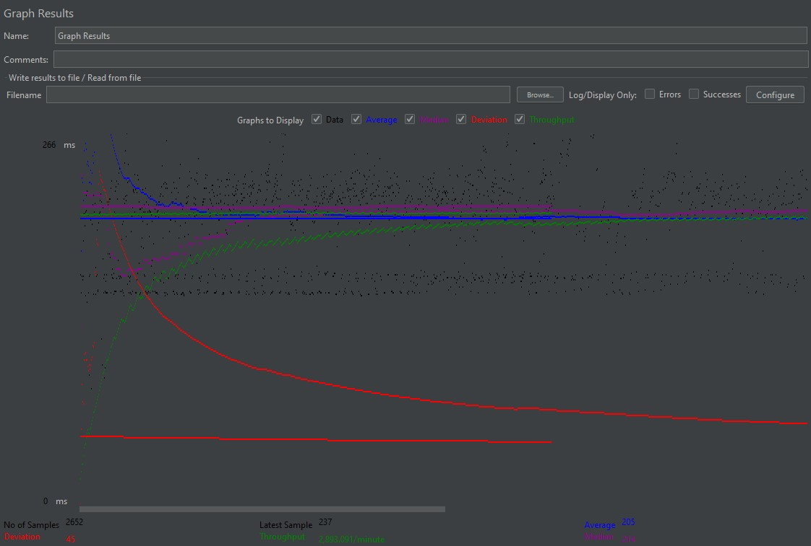

# Fabflix

Fabflix is an e-commerce web application dedicated to movie browsing and rentals. Users can login to the website, search for movies based on multiple parameters, add movies to a shopping cart, and proceed to checkout. The motivation for this full-stack project was to explore the architecture of modern web applications and the use of DBMS techniques by fully implementing a shopping website. The technologies used include HTML/CSS/JavaScript, Tomcat, MySQL, Java JDBC, and AWS/GCP.

The following features have been implemented:
- User login and employee login
- Employee dashboard to add movies
- Full-text search, autocomplete, and fuzzy search
- Browsing by movie genre, movie title
- Shopping cart
- Recording of sales
- Security: reCAPTCHA, HTTPS, password encryption
- Fabflix Android Application
- XML Parsing to add external data about movies to the database
- Scaling: Database replication, deployment in multiple AWS instances, load balancing using Apache Server
- Testing: JMeter testing


## Application Deployment on Tomcat

### Before running:

- Set up Java 11 and Maven
- Set up MYSQL, create 'moviedb' database using createtable.sql file, and then populate with data
- Run alter-sales.sql to apply the changes needed to moviedb.sales as required in project 2
- Run create-employees.sql and insert the classta employee record to moviedb.employees to apply the changes needed to moviedb.sales as required in project 3
- Run `CREATE USER 'mytestuser'@'localhost' IDENTIFIED BY 'My6$Password';`
- Run `GRANT ALL PRIVILEGES ON * . * TO 'mytestuser'@'localhost'`; then `quit;`
- Encrypt Passwords using UpdateSecurePassword.java from https://github.com/UCI-Chenli-teaching/cs122b-fall21-project3-encryption-example for customers table and employees table

### To run:

1. Clone this repository using `git clone https://github.com/UCI-Chenli-teaching/cs122b-fall21-team-7.git`
2. Create your own recaptcha secret key: Create RecaptchaConstants.java and add `public static final String SECRET_KEY ="<YOUR SECRET KEY>";`
3. Update the client key in the html form accordingly, the file is removed from this repository since it's a secret key
4. Open IntelliJ -> Import Project -> Choose the fabflix_web directory (The root path must contain the pom.xml) -> Choose Open -> Click on Finish -> The IntelliJ will load automatically
5. Create a configuration so IntelliJ builds and runs the project. Choose Tomcat Local, Java 11, and the war or war exploded file as artifact
6. The project should run. Not other frameworks were used aside from JQuery and Bootstrap which were already in the cs122b-fall21-project1-api-example
7. Run DomParserDriver to update moviedb with the xml files (you need to provide actors.xml, casts.xml, mains.xml, etc)

### To run Android App:
1. Make sure the web application is deployed in Tomcat
2. Open the fabflix_mobile directory in Android Studio
3. Make sure the Gradle plugin is updated and let gradle build the files
4. Run using Android version 30 and Pixel 3A emulator

## Substring Matching Design

- In Searching feature: title, director and star's name matching were all implemented using AND, LIKE and the '%input%' pattern in the query for matching
- As established in the requirements, year does not support substring matching so in the query it has to exactly match

## Optimization Strategies

1. Use of batch inserts instead of using executeUpdate() for every insert. This optimization was used in each parser at the data insertion function to speed up insertions considerably. To avoid memory overhead, batches were limited to chunks of 4000/5000 insert commands. When the amount of commands reaches that number, the batch is executed and cleaned.

2. Keeping track of duplicates for movies and stars both from the database data and the xml files can increase the execution time massively in a naive approach. Using Sets and Maps to check for duplicates in near O(1) time is another optimization strategy used that improved time by a lot. For this, the Movie object implements the Comparable interface in order for Movie objects to be stored in a TreeSet / TreeMap. Similarly, Star has a equalsTo() method and Genre has equalsTo() and hashCode() implemented.

## Inconsistent Data Report

When you run DomParserDriver (which runs the parsers for the xml files), three inconsistency reports will be generated at the local directory (named inconsistencies_{NAME OF XML FILE).txt 

You can also refer to the ones included in this repository.

## Fuzzy Search

- To implement fuzzy search first I modified the movies table to add fulltext on the title column:

`ALTER TABLE movies ADD FULLTEXT (title);`

- Autocomplete: If the autocomplete search on movie title returns less than 10 suggestions. The SuggestionsServlet proceeds to perform a fuzzy search to add more suggestions so it returns movies close enough to the query. As per the assignment task specifications, it takes the union of the results from LIKE and ed:

`SELECT id, title from movies WHERE title LIKE ? OR ed(title, ?) <= ?`

- In terms of design and implementation, the threshhold distance (the maximum distance allowed to classify a movie as 'close enough" to the query) is calculated based on the length of the query:

`int distance = (int) (0.4 * query.length());`

- Web main search: Unlike autocomplete, the fuzzy search for the web main search is always performed (in MoviesServlet) and the results are included in the movie list page. Note that the search results combine the full-text search and fuzzy search so the returned movies are listed in no particular order in the movie list. As per the assignment task specifications, it takes the union of the results from LIKE and ed:

`SELECT id, title from movies WHERE MATCH (title) AGAINST (? IN BOOLEAN MODE) OR title LIKE ? OR ed(title, ?) <= ?`

- The distance is calculated the same way as presented above

- Android: Design and implementation are the same as web main search since the activity that corresponds to the Movie List page for the Fabflix app makes a request to the MoviesServlet to get all the data as well. This allows fuzzy search to also work on the Android app.

## Connection Pooling

#### Include the filename/path of all code/configuration files in GitHub of using JDBC Connection Pooling.

The following configuration file adds connection pooling by declaring a datasource: 

fabflix_web/WebContent/META-INF/context.xml

The following source files use JDBC connection pooling:

* fabflix_web/src/CheckoutServlet.java
* fabflix_web/src/DashboardServlet.java
* fabflix_web/src/LoginEmployeeServlet.java
* fabflix_web/src/LoginServlet.java
* fabflix_web/src/MainPageServlet.java
* fabflix_web/src/MoviesServlet.java
* fabflix_web/src/ShoppingCartServlet.java
* fabflix_web/src/SingleMovieServlet.java
* fabflix_web/src/SingleStarServlet.java
* fabflix_web/src/SuggestionsServlet.java

#### Explain how Connection Pooling is utilized in the Fabflix code.

Connection pooling aims to optimize the use of JDBC and connections in servlets. Instead of each servlet manually creating a connection and occupying resources, the servlets connect to the database using a pool of available connections. 
When required, a servlet calls the getConnection() method on the DataSource object.

The following line in most of the servlet's code shows how connection pooling is used in the Fabflix website:
```
dataSource = (DataSource) new InitialContext().lookup("java:comp/env/jdbc/localdb");
```
dataSource.getConnection() is called in a try-with resource to get the connection from a pool and then automatically 'return it' after use.

#### Explain how Connection Pooling works with two backend SQL

With two backend SQL databases, when executing reading operations, connections can be either connections to the master or slave database (depending on which Tomcat instance is receiving the requests). When writing to the database, the connections are from the master database. So,
two connection pools are created in total.

# Master/Slave 

#### Include the filename/path of all code/configuration files in GitHub of routing queries to Master/Slave SQL.

The following configuration file declares a datasource that always connect to the master SQL database (masterdb) and a local datasource (localdb which is either master or slave depending on which Tomcat instance is serving the requests in the scaled version): 

fabflix_web/WebContent/META-INF/context.xml

The following source files always connect to the master database since these servlets execute writing operations:
* fabflix_web/src/CheckoutServlet.java
* fabflix_web/src/DashboardServlet.java

#### How read/write requests were routed to Master/Slave SQL?

As mentioned before, there is an additional data source declared in `context.xml` that establishes a connection pool to the master MYSQL database.

For read operations, either the master or slave are used depending on what tomcat instance the Apache proxy links to. This is because both databases are synced thanks to MYSQL replication so there won't a difference in the data.
For write operations, the master database is always used for the same reason. 
    

# JMeter TS/TJ Time Logs
#### Instructions of how to use the `log_processing.*` script to process the JMeter logs.

1. Install python3

2. Edit `log_processing.py`. On line 17, change the variable filename to the name of your JMeter log file OR change your file name to jmeter-log.txt
```
filename = 'jmeter-log.txt'
```

3. Run the python script
```
python log_processing.py
```

4. The TS and TJ values of the log file will be displayed.

# JMeter TS/TJ Time Measurement Report

| **Single-instance Version Test Plan**          | **Graph Results Screenshot** | **Average Query Time(ms)** | **Average Search Servlet Time(ms)** | **Average JDBC Time(ms)** | **Analysis** |
|------------------------------------------------|------------------------------|----------------------------|-------------------------------------|---------------------------|--------------|
| Case 1: HTTP/1 thread                          |    | 152                        | 13.025                            | 12.826                   | Fastest average query time of all single instance cases. This is expected so I will use these measures to analyse the other test cases' results.          |
| Case 2: HTTP/10 threads                        |    | 219                        | 79.986                            | 79.839                  | With 10 threads sending requests to a single instance every measure increases considerably.          |
| Case 3: HTTPS/10 threads                       |    | 293                        | 76.201                           | 75.947                 | Servlet times and jdbc times are very similar to test case 2. As expected, only the query time increased probably due to HTTPS encryption/decryption time for all traffic. 	           |
| Case 4: HTTP/10 threads/No connection pooling  |    | 303                       | 85.788                           | 85.788                 | As expected, no connection pooling and 10 threads performed the worst. All time measures increased.           |

| **Scaled Version Test Plan**                   | **Graph Results Screenshot** | **Average Query Time(ms)** | **Average Search Servlet Time(ms)** | **Average JDBC Time(ms)** | **Analysis** |
|------------------------------------------------|------------------------------|----------------------------|-------------------------------------|---------------------------|--------------|
| Case 1: HTTP/1 thread                          |    | 153                        |     13.990                             | 13.643               | These time measures are almost identical to test case 1 in single instance. This is expected since only one user is sending request and they end up in the same instance due to sticky sessions         |
| Case 2: HTTP/10 threads                        |    | 131                         | 20.231                                  | 20.060                        | As expected, I can see the advantage of the scaled-version. Compared to HTTP/10 threads tested in single instance, these time measures are considerably lower meaning users receive responses faster thanks to load balancing.         |
| Case 3: HTTP/10 threads/No connection pooling  |    | 205                       | 55.308                          | 55.157                | Performance is lower compared to scaled-version case 2 due to no connection pooling. But the difference with single instance test case 4 shows that load balancing again reduced all time measures under the same conditions considerably as expected.            |

